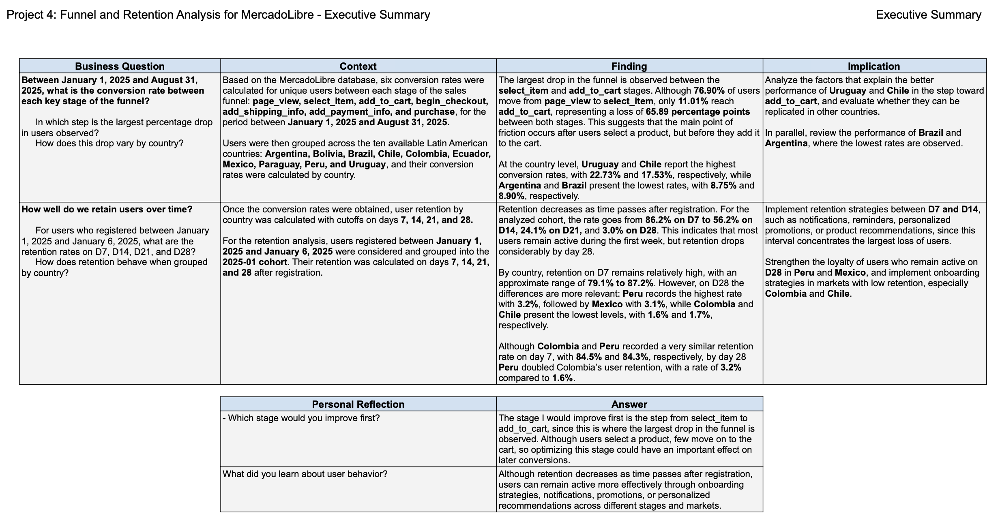
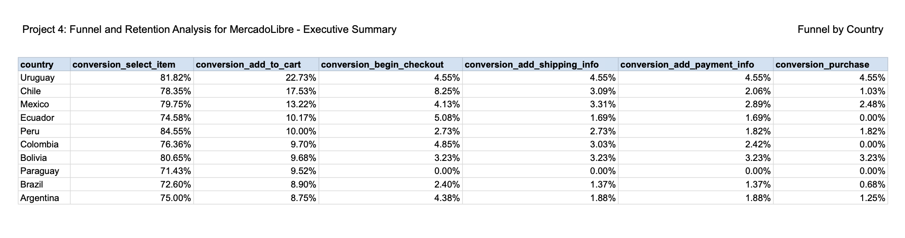
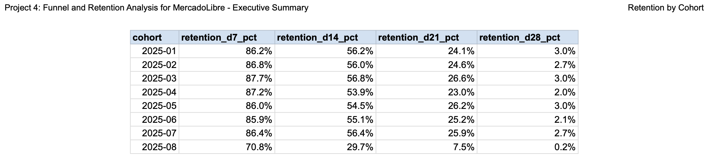
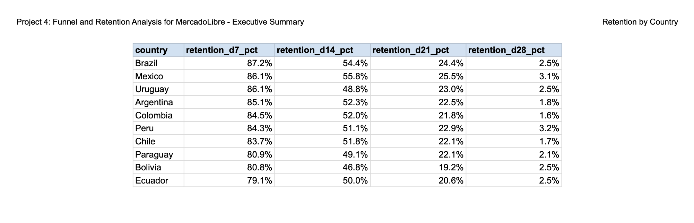

# MercadoLibre Funnel and Retention Analysis

SQL-based analysis of MercadoLibre’s conversion funnel and user retention across ten Latin American countries.

## Project overview

This project evaluates user behavior across the e-commerce conversion funnel and analyzes retention on days 7, 14, 21 and 28.

The objective was to identify the stages with the highest user drop-off, compare performance across countries and cohorts, and develop business recommendations to improve conversion and long-term engagement.

The analysis covers activity from January to August 2025.

### Executive summary

## Business questions

The project addresses the following questions:

- At which stage does the largest conversion drop occur?
- Which countries achieve the strongest and weakest funnel performance?
- How does user retention change between D7, D14, D21 and D28?
- Which countries and cohorts show the strongest long-term retention?
- What actions could improve conversion and user engagement?

## Analysis methodology

The project was developed using SQL in TripleTen’s learning environment.

The analysis included:

- Organizing user events by funnel stage.
- Calculating the percentage of users reaching each stage.
- Comparing funnel performance across ten Latin American countries.
- Grouping users into cohorts according to their first activity date.
- Measuring retention at D7, D14, D21 and D28.
- Validating results and identifying the main business opportunities.

## Conversion funnel

The overall funnel results were:

| Funnel stage | Conversion rate |
|---|---:|
| Select item | 76.90% |
| Add to cart | 11.01% |
| Begin checkout | 4.00% |
| Add shipping information | 2.42% |
| Add payment information | 2.09% |
| Purchase | 1.25% |

The largest drop occurred between **product selection and cart addition**, representing a decrease of **65.89 percentage points**.

This indicates that the main conversion challenge occurs before users formally begin the purchasing process.

## Funnel performance by country

Country-level analysis identified important differences in cart addition performance:

- Uruguay: 22.73%
- Chile: 17.53%
- Brazil: 8.90%
- Argentina: 8.75%

Uruguay and Chile recorded the strongest results at the add-to-cart stage, while Argentina and Brazil showed the greatest opportunity for improvement.

## Retention analysis

Retention was evaluated at:

- D7
- D14
- D21
- D28

For the January 1–6 cohort, retention declined as follows:

| Retention period | Retention rate |
|---|---:|
| D7 | 86.2% |
| D14 | 56.2% |
| D21 | 24.1% |
| D28 | 3.0% |

The results show a sharp decrease after the first week, with particularly significant losses between D14 and D28.

## Retention by country

At D28, the strongest retention results were observed in:

- Peru: 3.2%
- Mexico: 3.1%

The lowest D28 results included:

- Chile: 1.7%
- Colombia: 1.6%

Although overall long-term retention was low, Peru and Mexico showed comparatively stronger performance.

## Key findings

- The main funnel bottleneck occurs between product selection and cart addition.
- Only 1.25% of users completed a purchase.
- Uruguay and Chile performed best at the add-to-cart stage.
- Argentina and Brazil showed the weakest cart addition results.
- Retention declined sharply after D7.
- Long-term retention at D28 remained close to 3% or lower.
- Peru and Mexico achieved the strongest D28 retention results.

## Business recommendations

### Improve the transition from product selection to cart

Potential actions include:

- Simplifying the add-to-cart process.
- Making calls to action more visible.
- Reviewing product information, pricing and availability.
- Identifying technical or usability barriers.
- Testing personalized product recommendations.

### Strengthen retention between D7 and D14

Potential actions include:

- Personalized follow-up messages.
- Product reminders and relevant recommendations.
- Targeted promotions based on browsing behavior.
- Re-engagement campaigns during the first two weeks.
- Analysis of successful practices in countries with stronger retention.

### Investigate country-level differences

The stronger results in Uruguay, Chile, Peru and Mexico should be analyzed further to identify practices that could be adapted to lower-performing markets.

## Tools and skills

- SQL
- Common Table Expressions
- Funnel Analysis
- Cohort Analysis
- Retention Analysis
- Data Validation
- Business Analysis
- KPI Interpretation
- Executive Reporting

## Project workbook

The complete project workbook, including results, tables and visualizations, is available in Google Sheets:

[Open the MercadoLibre Funnel and Retention Analysis workbook](https://docs.google.com/spreadsheets/d/1j0Ln3y3g58qErGPMvOTCVIhawGD_T5hNhAE8IP0xCd0/edit?usp=drive_link)

## Project files

The analysis was originally developed in TripleTen’s SQL learning environment. The original SQL queries are not currently available outside the platform.

This repository documents the business problem, methodology, principal findings and recommendations. SQL files may be added later if the original queries are recovered or reconstructed.

## Limitations

- The analysis is descriptive and does not establish causality.
- The available results summarize user behavior but do not include qualitative information explaining why users abandoned the funnel.
- Additional variables such as device type, acquisition channel, product category and campaign source could support deeper analysis.
- Long-term retention should be interpreted in the context of the available observation period.

## Author

**Rodrigo Garza García**

International affairs, public policy, strategy and data analytics professional.

- GitHub: [rogarzag](https://github.com/rogarzag)
- LinkedIn: [Rodrigo Garza García](https://www.linkedin.com/in/rodrigogarzamx/)
- Email: rogarzag@gmail.com
